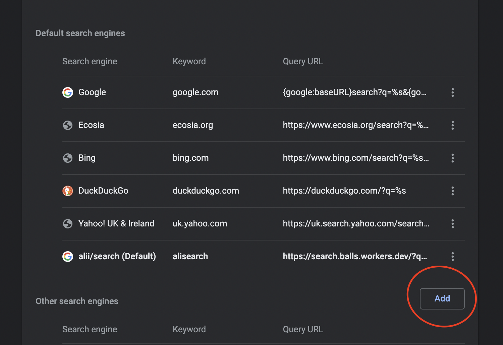

# search

Supercharge your searching with a simple cloudflare worker.

### Guide:

Add `https://search.balls.workers.dev/?q=` as a custom search engine to your browser. For Chrome, you would need to add `%s` on the end of that. Consult your browser's documentation for relavent information.

#### Fallback Engines

If you prefer duckduckgo, you can set your URL to the following to have your searched routed through that instead:

```
https://search.balls.workers.dev/?q=%s&engine=https:%2f%2fduckduckgo.com%2f%3fq={q}
```

#### Visual Guide





